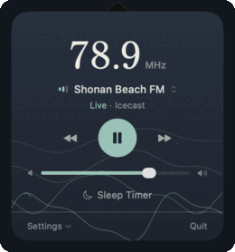
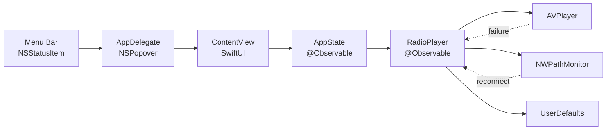

#  Nami (Wave)

A lightweight macOS menu bar app for streaming Japanese regional FM radio stations. Zero dependencies, ~30MB memory, lives entirely in your menu bar.

[](https://github.com/shkao/Nami/actions/workflows/ci.yml)
[](https://codecov.io/gh/shkao/Nami)
[](https://github.com/shkao/Nami)
[](https://github.com/shkao/Nami)
[](LICENSE)
[](../../releases/latest)

<p align="center">
  
</p>

## Why Nami

Community FM (`komyuniti efuemu`) stations are hyper-local and volunteer-run: surf reports from Shonan, temple bells from Kamakura, neighborhood listings from Chofu. They are a joy to leave on in the background, but tuning them in outside Japan usually means juggling browser players, and their public streams change hosts or start refusing requests without notice.

Nami streams all five from your menu bar through AVPlayer, reconnects itself when a stream drops, and runs a daily health check that catches a dead station before you do. It is built with SwiftUI, has zero external dependencies, and holds around 30 MB of memory.

## Features

- Stream 5 Japanese regional FM stations from the menu bar
- Real-time signal quality indicator (bitrate + buffer + stall scoring)
- Auto-reconnect with exponential backoff on stream failure or network loss
- Network reachability monitoring with automatic recovery
- Wake-from-sleep stream re-establishment
- Sleep timer to auto-stop playback at a specific time
- Launch-at-login toggle
- Volume and station persistence across sessions
- Full VoiceOver accessibility

## Stations

| Station         | Frequency | Location | Stream |
| --------------- | --------- | -------- | ------ |
| FM Blue Shonan  | 78.5 MHz  | Yokosuka | HLS    |
| Shonan Beach FM | 78.9 MHz  | Shonan   | Icecast |
| Kamakura FM     | 82.8 MHz  | Kamakura | HLS    |
| Chofu FM        | 83.8 MHz  | Tokyo    | HLS    |
| FM Salus        | 84.1 MHz  | Yokohama | HLS    |

## Keeping the streams alive

Community FM streams are fragile: hosts move, URLs expire, and CDNs start demanding new request headers. The smartstream CDN behind four of these stations began returning `403` to requests without an `Origin` header, which would have broken playback with no visible error. Two mechanisms keep Nami ahead of that:

- **Per-station request headers.** Each station carries whatever headers its stream now requires (set in `Station.swift`), so playback survives when a provider tightens its rules.
- **A daily probe.** `scripts/check_streams.sh` fetches every stream and prints a per-station OK/FAIL table, exiting non-zero on any failure. The [Stream Health](.github/workflows/stream-health.yml) GitHub Action runs it every morning, so a broken stream surfaces as a red build here instead of silence in your menu bar.

```bash
scripts/check_streams.sh
```

## Architecture



## Installation

### Option 1: Homebrew (Recommended)

```bash
brew tap shkao/tap
brew install --cask nami
```

### Option 2: Download Pre-built App

1. Go to [Releases](../../releases)
2. Download `Nami.zip` from the latest release
3. Extract the ZIP file
4. Drag `Nami.app` to your Applications folder
5. Open Nami from Applications

> **Note for unsigned builds**: On first launch, macOS may block the app. To open:
>
> - Right-click (or Control-click) on Nami.app
> - Select "Open" from the context menu
> - Click "Open" in the dialog that appears

### Option 3: Build from Source

#### Requirements

- macOS 14.0 (Sonoma) or later
- Xcode 15.0 or later

#### Steps

```bash
# Clone the repository
git clone https://github.com/shkao/Nami.git
cd Nami

# Build the app
xcodebuild -scheme Nami -configuration Release build

# Find the built app
open ~/Library/Developer/Xcode/DerivedData/Nami-*/Build/Products/Release/
```

Or open `Nami.xcodeproj` in Xcode and press `Cmd+R` to build and run.

## Usage

1. Click the wave icon in the menu bar
2. Click the play button to start streaming
3. Use the dropdown to select a station (each row shows frequency and location), or use prev/next to switch
4. Adjust volume with the slider
5. Set a sleep timer to auto-stop at a specific time
6. Open the Settings menu to toggle Launch at Login
7. Click "Quit" to exit

### Sleep Timer

Click "Sleep Timer" to set a time for the radio to automatically stop:

1. Click the moon icon to open the picker
2. Pick a preset (15, 30, or 60 min) or set a custom stop time (defaults to 22:30) and click "Set"
3. The timer shows "Sleep at [time]" when active
4. Click again to modify the timer, then click "Update"
5. Click "Off" in the picker to cancel

### Signal Quality Indicator

The bars next to the station name show connection quality:

- 3 bars: Excellent connection
- 2 bars: Good connection
- 1 coral bar: Poor connection (may buffer); the station name also turns coral

While playing, a status line under the station name shows the live indicator, stream type, and measured bitrate.

### Auto-Reconnect

When a stream fails or the network drops, Nami automatically retries with increasing delays (2s, 4s, 8s, 16s, 32s). The status line shows "Reconnecting…" during retries. If all 5 attempts fail, tap play to try again manually.

## Configuration

Settings are automatically saved:

- **Volume**: Persisted between sessions
- **Last Station**: Automatically restored on launch
- **Launch at Login**: Toggled via the Settings menu

Settings are stored in UserDefaults (`com.nami.app`).

## Project Structure

```
Nami/
├── App/
│   └── NamiApp.swift         # App entry point, AppDelegate, NSPopover
├── Audio/
│   └── RadioPlayer.swift     # AVPlayer wrapper, per-station headers, reconnect, network monitor
├── Models/
│   ├── AppState.swift        # Observable state hub, sleep timer, wake handler
│   └── Station.swift         # Station definitions (5 stations)
├── Views/
│   └── ContentView.swift     # SwiftUI popover UI
└── Resources/
    ├── Assets.xcassets       # App icon, menu bar icon (Hamonshu wave mark)
    ├── ShipporiMincho-Medium.ttf  # bundled frequency typeface (subset)
    ├── ShipporiMincho-OFL.txt     # font license (SIL OFL)
    └── Info.plist            # LSUIElement=YES (menu bar only)

NamiTests/
├── AppStateTests.swift       # 20 tests
├── RadioPlayerTests.swift    # 22 tests
├── StationTests.swift        # 9 tests
└── NamiAppTests.swift        # 7 tests
```

## Development

### Building

```bash
# Debug build
xcodebuild -scheme Nami -configuration Debug build

# Release build
xcodebuild -scheme Nami -configuration Release build

# Clean build
xcodebuild -scheme Nami clean build
```

### Testing

```bash
# Run tests
xcodebuild test -scheme Nami -destination 'platform=macOS'

# Run tests with coverage
xcodebuild test -scheme Nami -destination 'platform=macOS' -enableCodeCoverage YES
```

> When you add or change a station, keep the list in `scripts/check_streams.sh`
> in sync with `Nami/Models/Station.swift` so the health probe stays accurate.

### Creating a Release

Releases are automatically built by GitHub Actions when you push a version tag:

```bash
git tag v1.1.0
git push origin v1.1.0
```

This will:

1. Run the full test suite
2. Build the app in Release configuration with version injected from the tag
3. Create a ZIP archive
4. Create a GitHub Release with the artifact

## Troubleshooting

### App won't open (macOS security)

For unsigned builds, macOS Gatekeeper may block the app:

**Method 1: Right-click to open**

1. Right-click (or Control-click) on Nami.app
2. Select "Open" from the context menu
3. Click "Open" in the security dialog

**Method 2: System Settings**

1. Open System Settings, then Privacy & Security
2. Scroll down to find "Nami was blocked"
3. Click "Open Anyway"

**Method 3: Remove Quarantine Attribute (Advanced)**
If you are comfortable with the terminal, you can manually remove the quarantine flag:

```bash
xattr -d com.apple.quarantine /Applications/Nami.app
```

### No audio playing

1. Check your system volume is not muted
2. Check the in-app volume slider
3. Try switching to a different station
4. Verify your internet connection

### Stream keeps buffering

- Check your internet connection
- Try a different station (some may have better servers)
- The signal quality indicator shows real-time connection status
- Nami will auto-reconnect if the stream drops

## Future Plans

- Real-time Japanese transcription using mlx-whisper
- Speech detection to skip music portions
- Scrolling transcript view

## Contributing

1. Fork the repository
2. Create a feature branch: `git checkout -b feature/my-feature`
3. Commit changes: `git commit -am 'Add my feature'`
4. Push to branch: `git push origin feature/my-feature`
5. Open a Pull Request

## License

MIT License - see [LICENSE](LICENSE) for details.

## Acknowledgments

- Stream sources provided by respective radio stations
- Built with SwiftUI and AVFoundation
- Wave motif inspired by Mori Yuzan's _Hamonshu_ (波紋集, 1903), public domain
- Frequency set in [Shippori Mincho](https://github.com/fontdasu/ShipporiMincho) (SIL Open Font License)
