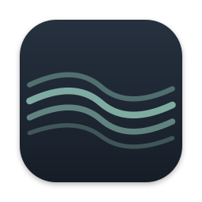
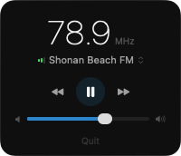
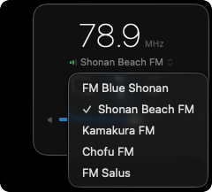
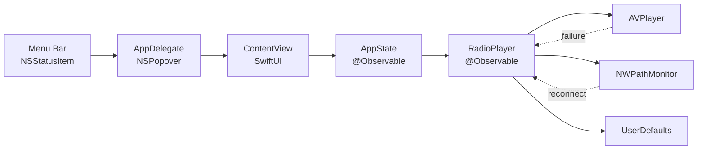

#  Nami (Wave)

A lightweight macOS menu bar app for streaming Japanese regional FM radio stations. Zero dependencies, ~30MB memory, lives entirely in your menu bar.

[](https://github.com/shkao/Nami/actions/workflows/ci.yml)
[](https://codecov.io/gh/shkao/Nami)
[](https://github.com/shkao/Nami)
[](https://github.com/shkao/Nami)
[](LICENSE)
[](../../releases/latest)

<p align="center">
  
  
</p>

## About

Nami tunes into five community FM stations along Japan's Shonan coast and greater Tokyo area. It sits in your menu bar, plays HLS/Icecast streams through AVPlayer, and gets out of the way. Built with SwiftUI and zero external dependencies.

**Why these stations?** Community FM (`komyuniti efuemu`) stations are hyper-local, volunteer-run, and carry programming you won't find on major networks: surf reports from Shonan, temple bells from Kamakura, neighborhood event listings from Chofu.

## Features

- Stream 5 Japanese regional FM stations from the menu bar
- Real-time signal quality indicator (bitrate + buffer + stall scoring)
- Auto-reconnect with exponential backoff on stream failure or network loss
- Network reachability monitoring with automatic recovery
- Wake-from-sleep stream re-establishment
- Sleep timer to auto-stop playback at a specific time
- Launch-at-login toggle
- Volume and station persistence across sessions
- Full VoiceOver accessibility

## Stations

| Station         | Frequency | Location | Stream |
| --------------- | --------- | -------- | ------ |
| FM Blue Shonan  | 78.5 MHz  | Yokosuka | HLS    |
| Shonan Beach FM | 78.9 MHz  | Shonan   | Icecast |
| Kamakura FM     | 82.8 MHz  | Kamakura | HLS    |
| Chofu FM        | 83.8 MHz  | Tokyo    | HLS    |
| FM Salus        | 84.1 MHz  | Yokohama | HLS    |

## Architecture



## Installation

### Option 1: Homebrew (Recommended)

```bash
brew tap shkao/tap
brew install --cask nami
```

### Option 2: Download Pre-built App

1. Go to [Releases](../../releases)
2. Download `Nami.zip` from the latest release
3. Extract the ZIP file
4. Drag `Nami.app` to your Applications folder
5. Open Nami from Applications

> **Note for unsigned builds**: On first launch, macOS may block the app. To open:
>
> - Right-click (or Control-click) on Nami.app
> - Select "Open" from the context menu
> - Click "Open" in the dialog that appears

### Option 3: Build from Source

#### Requirements

- macOS 14.0 (Sonoma) or later
- Xcode 15.0 or later

#### Steps

```bash
# Clone the repository
git clone https://github.com/shkao/Nami.git
cd Nami

# Build the app
xcodebuild -scheme Nami -configuration Release build

# Find the built app
open ~/Library/Developer/Xcode/DerivedData/Nami-*/Build/Products/Release/
```

Or open `Nami.xcodeproj` in Xcode and press `Cmd+R` to build and run.

## Usage

1. Click the waveform icon in the menu bar
2. Click the play button to start streaming
3. Use the dropdown to select a station, or use prev/next to switch
4. Adjust volume with the slider
5. Set a sleep timer to auto-stop at a specific time
6. Toggle the sunrise icon to launch Nami at login
7. Click "Quit" to exit

### Sleep Timer

Click "Sleep Timer" to set a time for the radio to automatically stop:

1. Click the moon icon to open the time picker
2. Set your desired stop time (defaults to 22:30)
3. Click "Set" to activate
4. The timer shows "Off at [time]" when active
5. Click again to modify the timer, then click "Update"
6. Click "Off" in the picker to cancel

### Signal Quality Indicator

The bars next to the station name show connection quality:

- 3 green bars: Excellent connection
- 2 green bars: Good connection
- 1 orange bar: Poor connection (may buffer)

### Auto-Reconnect

When a stream fails or the network drops, Nami automatically retries with increasing delays (2s, 4s, 8s, 16s, 32s). A "Reconnecting..." banner appears during retries. If all 5 attempts fail, tap play to try again manually.

## Configuration

Settings are automatically saved:

- **Volume**: Persisted between sessions
- **Last Station**: Automatically restored on launch
- **Launch at Login**: Toggled via the sunrise icon

Settings are stored in UserDefaults (`com.nami.app`).

## Project Structure

```
Nami/
├── App/
│   └── NamiApp.swift         # App entry point, AppDelegate, NSPopover
├── Audio/
│   └── RadioPlayer.swift     # AVPlayer wrapper, reconnect, network monitor
├── Models/
│   ├── AppState.swift        # Observable state hub, sleep timer, wake handler
│   └── Station.swift         # Station definitions (5 stations)
├── Views/
│   └── ContentView.swift     # SwiftUI popover UI
└── Resources/
    ├── Assets.xcassets       # App icons
    └── Info.plist            # LSUIElement=YES (menu bar only)

NamiTests/
├── AppStateTests.swift       # 20 tests
├── RadioPlayerTests.swift    # 22 tests
├── StationTests.swift        # 7 tests
└── NamiAppTests.swift        # 7 tests
```

## Development

### Building

```bash
# Debug build
xcodebuild -scheme Nami -configuration Debug build

# Release build
xcodebuild -scheme Nami -configuration Release build

# Clean build
xcodebuild -scheme Nami clean build
```

### Testing

```bash
# Setup test target (first time only)
gem install xcodeproj
ruby scripts/add_test_target.rb

# Run tests
xcodebuild test -scheme Nami -destination 'platform=macOS'

# Run tests with coverage
xcodebuild test -scheme Nami -destination 'platform=macOS' -enableCodeCoverage YES
```

### Creating a Release

Releases are automatically built by GitHub Actions when you push a version tag:

```bash
git tag v1.1.0
git push origin v1.1.0
```

This will:

1. Run the full test suite
2. Build the app in Release configuration with version injected from the tag
3. Create a ZIP archive
4. Create a GitHub Release with the artifact

## Troubleshooting

### App won't open (macOS security)

For unsigned builds, macOS Gatekeeper may block the app:

**Method 1: Right-click to open**

1. Right-click (or Control-click) on Nami.app
2. Select "Open" from the context menu
3. Click "Open" in the security dialog

**Method 2: System Settings**

1. Open System Settings, then Privacy & Security
2. Scroll down to find "Nami was blocked"
3. Click "Open Anyway"

**Method 3: Remove Quarantine Attribute (Advanced)**
If you are comfortable with the terminal, you can manually remove the quarantine flag:

```bash
xattr -d com.apple.quarantine /Applications/Nami.app
```

### No audio playing

1. Check your system volume is not muted
2. Check the in-app volume slider
3. Try switching to a different station
4. Verify your internet connection

### Stream keeps buffering

- Check your internet connection
- Try a different station (some may have better servers)
- The signal quality indicator shows real-time connection status
- Nami will auto-reconnect if the stream drops

## Future Plans

- Real-time Japanese transcription using mlx-whisper
- Speech detection to skip music portions
- Scrolling transcript view

## Contributing

1. Fork the repository
2. Create a feature branch: `git checkout -b feature/my-feature`
3. Commit changes: `git commit -am 'Add my feature'`
4. Push to branch: `git push origin feature/my-feature`
5. Open a Pull Request

## License

MIT License - see [LICENSE](LICENSE) for details.

## Acknowledgments

- Stream sources provided by respective radio stations
- Built with SwiftUI and AVFoundation
