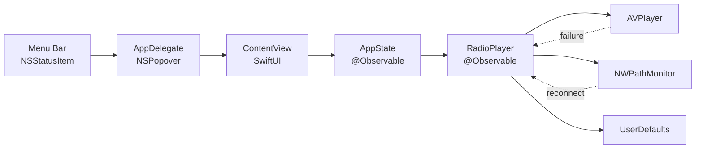

<h1 align="center">
  <br>
  Nami 波
</h1>

<p align="center"><em>Japan's Shonan-coast community FM, live in your macOS menu bar.</em></p>

<p align="center">
  <a href="https://github.com/shkao/Nami/actions/workflows/ci.yml"></a>
  <a href="https://codecov.io/gh/shkao/Nami"></a>
  
  
  <a href="LICENSE"></a>
  <a href="../../releases/latest"></a>
</p>

<p align="center">
  
</p>

Nami tunes into five hyper-local community FM stations along Japan's Shonan coast: surf reports from Shonan, temple bells from Kamakura, neighborhood listings from Chofu. It lives in your menu bar, reconnects itself when a stream drops, and runs a daily health check that catches a dead station before you do. Built with SwiftUI, zero external dependencies, about 30 MB of memory.

## The stations

| Station         | Frequency | Location | Stream  |
| --------------- | --------- | -------- | ------- |
| FM Blue Shonan  | 78.5 MHz  | Yokosuka | HLS     |
| Shonan Beach FM | 78.9 MHz  | Shonan   | Icecast |
| Kamakura FM     | 82.8 MHz  | Kamakura | HLS     |
| Chofu FM        | 83.8 MHz  | Tokyo    | HLS     |
| FM Salus        | 84.1 MHz  | Yokohama | HLS     |

## Why it keeps playing

Community FM streams are fragile: hosts move, URLs expire, and CDNs start demanding new request headers. The smartstream CDN behind four of these stations began returning `403` to requests without an `Origin` header, which would have broken playback with no visible error. Nami stays ahead of that on two fronts:

- **Per-station request headers.** Each station carries whatever headers its stream now requires (set in `Station.swift`), so playback survives when a provider tightens its rules.
- **A daily probe.** `scripts/check_streams.sh` fetches every stream and prints a per-station OK/FAIL table, exiting non-zero on any failure. The [Stream Health](.github/workflows/stream-health.yml) GitHub Action runs it every morning, so a broken stream surfaces as a red build here instead of silence in your menu bar.

```bash
scripts/check_streams.sh
```

While a stream is live, Nami scores its quality from bitrate, buffer state, and stalls, and reconnects automatically with backoff (2s, 4s, 8s, 16s, 32s) through stream failures, network drops, and wake-from-sleep.

## Install

**Homebrew** (recommended):

```bash
brew tap shkao/tap
brew install --cask nami
```

**Pre-built app:** download `Nami.zip` from [Releases](../../releases), unzip, and drag `Nami.app` to Applications. The build is unsigned, so on first launch right-click the app and choose **Open**. If Gatekeeper still blocks it:

```bash
xattr -d com.apple.quarantine /Applications/Nami.app
```

**From source** (macOS 14+, Xcode 15+):

```bash
git clone https://github.com/shkao/Nami.git
cd Nami
xcodebuild -scheme Nami -configuration Release build
```

## Using it

Click the wave icon in the menu bar, then hit play. Pick a station from the dropdown (each row shows its frequency and location) or step through with prev/next. The moon icon sets a sleep timer with 15/30/60-minute presets or a custom time. Launch at Login lives in the Settings menu. Volume and last station persist across launches.

## Architecture



## Development

```bash
# Build and test
xcodebuild -scheme Nami -configuration Debug build
xcodebuild test -scheme Nami -destination 'platform=macOS'
```

The suite has 58 tests across `AppState`, `RadioPlayer`, `Station`, and app setup. When you add or change a station, update both `Nami/Models/Station.swift` and the list in `scripts/check_streams.sh` so the health probe stays accurate.

Tagging a version ships a release: pushing `vX.Y.Z` runs the tests, builds Release with the version injected from the tag, and publishes a GitHub Release with the zipped app.

## Troubleshooting

- **App won't open (Gatekeeper).** Right-click the app and choose Open, or run the `xattr` command above.
- **No audio.** Check system and in-app volume, then try another station.
- **Stuck buffering.** Check your connection; Nami auto-reconnects, and the signal bars show live quality.

## License and credits

MIT, see [LICENSE](LICENSE). Frequency set in [Shippori Mincho](https://github.com/fontdasu/ShipporiMincho) (SIL Open Font License). Wave motif inspired by Mori Yuzan's _Hamonshu_ (波紋集, 1903, public domain). Streams provided by the respective community stations.
